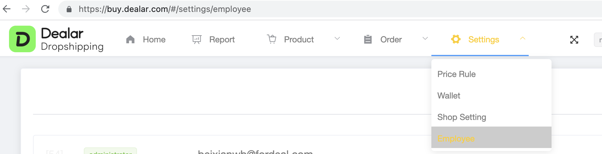
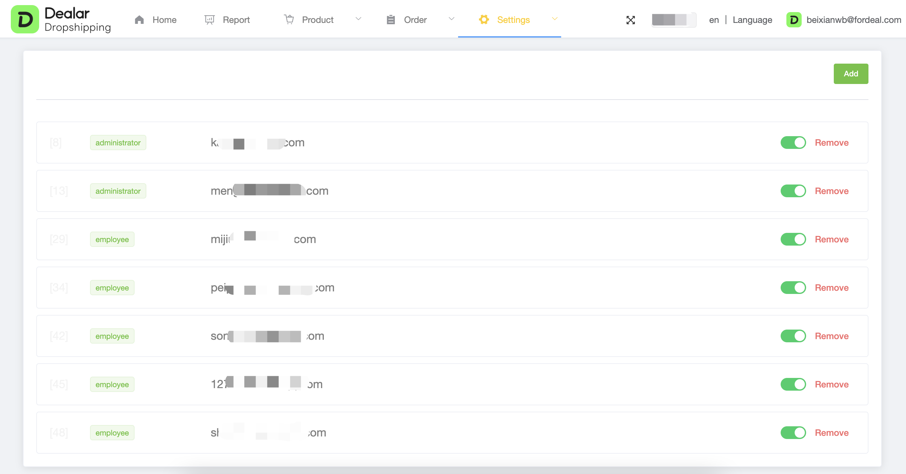
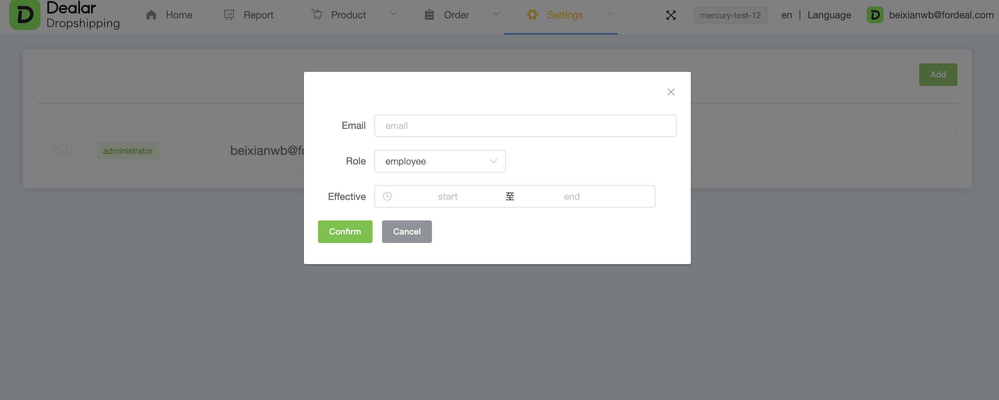

# Employee

## Employee

You can manage your employees in settings/employee.

> The user who creates the shop is the shop administrator by default

#### Address

https://buy.dealar.com/#/settings/employee

Settings / Employee

<figure><figcaption></figcaption></figure>

#### Screenshot

<figure><figcaption></figcaption></figure>

#### How to use

* click add to add employee

<figure><figcaption></figcaption></figure>

> notice : the email must already be registed in dealar.
